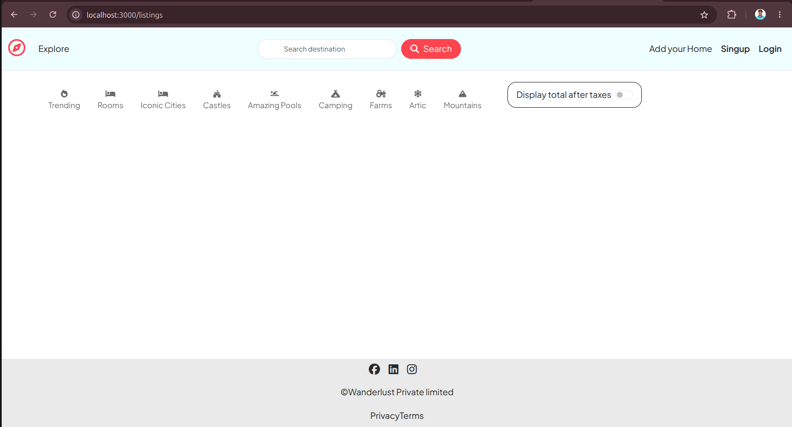

# Project Setup 
    > git clone repo_name

    > nvm use 20 

    > npm install

    > docker pull mongo:8

    > docker run -d --name wanderlust-mongodb -p 27017:27017 -v wanderlust-mongo-data:/data/db mongo:8

# Update .env 
    MONGODB_URI=mongodb://127.0.0.1:27017/wanderlust
    PORT=3000
    SECRET=HJKSDSDFSD
    MULTER_Storage_Credentaials=

# Run the Application 

    > node app.js

**Note**- You will not get anything Cause There is no any listing. so lets intialize the exsitng sampel data and owner will be a admin. but first create a admin and then add the admin uuid into intilize index.js file so that all lsiting will show admin is the owner.

# Initiliaze Admin Databae 
    initally some listing will be there so someone should be admin of those listing so first create a user using post request example 

    Example:
    http://localhost:3000/signup
    {
        "username": "admin",
        "email": "admin@gmail.com",
        "password": "admin@123"
    };

## Login Into DB and Create a admin User Name with this Credentials and copi the uuid 

    > docker exec -it wanderlust-mongodb mongosh
    > use wanderlust
    > db.users.find()

**Ex- insertedId: ObjectId('6a9493daa8fbee98251b13b9')**

# Next Step:
    copy the uid from the user collection and then go to /init/index.js
     update the UID in the code and then run this command 

     > node /init/index.js 

     Verify in the listing collection and loo for the admin UID is it updated or not.     

# Command to run the Project 
    Since this is not a react and next js project so build is not required.

    > node app.js
